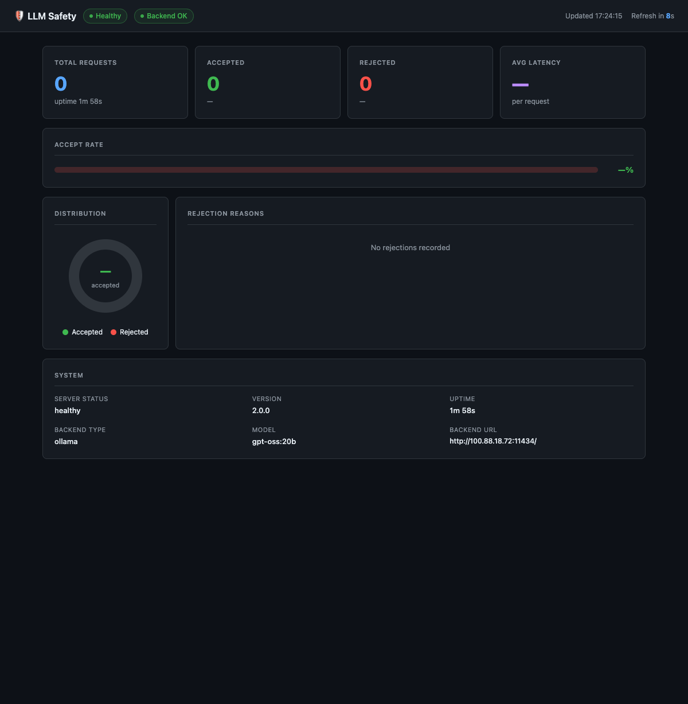

# LLM Safety Middleware

[](https://github.com/SahilChachra/LLM-Safety-Middleware/actions/workflows/tests.yml)
[](https://github.com/SahilChachra/LLM-Safety-Middleware/actions/workflows/docker.yml)
[](https://www.python.org/downloads/)
[](LICENSE)
[](Dockerfile)
[](https://github.com/psf/black)
[](CONTRIBUTING.md)

A **production-grade safety proxy** for Large Language Model APIs.  The
middleware sits between your clients and a remote LLM backend (Ollama,
OpenAI-compatible API, or any custom endpoint) and applies multiple layers of
content safety checks on both the input prompt and the generated response.

```
Client → [LLM Safety Middleware] → Remote LLM (Ollama / OpenAI / custom)
```

---

## Features

### Multi-Layer Safety Architecture
- **Rate Limiter** — Per-client sliding-window throttling
- **Token-Level Filter** — Regex-based harmful token detection with context awareness
- **Rule Engine** — spaCy NLP: instruction patterns, dangerous verb-object pairs, entity checks
- **Semantic Classifier** — Transformer-based scoring (`unitary/toxic-bert`)
- **Post-Generation Check** — Output content re-validated before returning to client

### Production-Ready
- ✅ Async HTTP proxy with exponential-backoff retry (skips retry on 4xx)
- ✅ Fail-closed: classifier errors → CRITICAL rejection
- ✅ Thread-safe statistics
- ✅ Configurable per environment (development / staging / production / high-security)
- ✅ Context manager support
- ✅ Extensible custom filter API
- ✅ FastAPI server with admin auth, CORS, request validation
- ✅ 74-test suite (unit + async integration)

---

## Table of Contents

- [Installation](#installation)
- [Quick Start](#quick-start)
- [Configuration](#configuration)
- [Usage Examples](#usage-examples)
- [Architecture](#architecture)
- [API Reference](#api-reference)
- [REST API](#rest-api)
- [Testing](#testing)
- [Deployment](#deployment)

---

## Installation

```bash
git clone https://github.com/SahilChachra/LLM-Safety-Middleware.git
cd LLM-Safety-Middleware

python -m venv venv
source venv/bin/activate   # Windows: venv\Scripts\activate

uv pip install -r requirements.txt
python -m spacy download en_core_web_sm
```

---

## Quick Start

### Input safety check (sync — no LLM call)

```python
from llm_safety_pipeline import SafetyPipeline

pipeline = SafetyPipeline()
status, report = pipeline.process("How was Julius Caesar assassinated?")

print(f"Status: {status}")
print(f"Safety Level: {report.safety_level.name}")
```

### Full middleware pipeline (async)

```python
import asyncio
from llm_safety_pipeline import LLMBackendConfig, SafetyPipeline

pipeline = SafetyPipeline(
    backend_config=LLMBackendConfig(
        backend_type="ollama",
        base_url="http://localhost:11434",
        model="llama2",
    )
)

async def main():
    status, report = await pipeline.async_process(
        "Write a paragraph about renewable energy.",
        generation_kwargs={"max_new_tokens": 150, "temperature": 0.7},
    )
    if status == "ACCEPTED":
        print(report.generated_text)
    else:
        print(f"Rejected: {report.rejection_reason.value}")
    await pipeline.async_close()

asyncio.run(main())
```

### One-line check

```python
from llm_safety_pipeline import quick_check

result = quick_check("How to bake a cake?")
print(f"Safe: {result['is_safe']}, Score: {result['safety_score']}")
```

---

## Configuration

### `SafetyConfig` — safety layers

```python
from llm_safety_pipeline import SafetyConfig

config = SafetyConfig(
    safety_model_name="unitary/toxic-bert",  # HuggingFace safety classifier
    spacy_model="en_core_web_sm",            # spaCy NLP model
    safety_threshold=0.75,                   # 0.0–1.0, higher = stricter
    toxicity_threshold=0.70,
    enable_pattern_matching=True,
    enable_token_filtering=True,
    enable_semantic_check=True,
    enable_post_generation_check=True,
    enable_rate_limiting=True,
    max_requests_per_minute=60,
    max_prompt_length=10_000,
    log_level="INFO",
    save_reports=True,
    reports_dir="./safety_reports",
    custom_banned_patterns=[],
    custom_allowed_contexts=[],
)
```

Load from / save to JSON:
```python
config = SafetyConfig.from_json("config_production.json")
config.save_json("config_backup.json")
```

### `LLMBackendConfig` — remote LLM

```python
from llm_safety_pipeline import LLMBackendConfig

# Explicit
backend = LLMBackendConfig(
    backend_type="openai",          # "ollama" | "openai" | "custom"
    base_url="https://api.openai.com",
    model="gpt-4o",
    api_key="sk-...",
    timeout_seconds=60.0,
    max_retries=3,
    max_new_tokens=512,
    temperature=0.7,
    top_p=0.95,
    system_prompt="You are a helpful assistant.",
)

# From environment variables
backend = LLMBackendConfig.from_env()
```

**Environment variables** (used by `api_server.py`):

| Variable | Default | Description |
|---|---|---|
| `LLM_BACKEND_TYPE` | `ollama` | `ollama` / `openai` / `custom` |
| `LLM_BASE_URL` | `http://localhost:11434` | Remote LLM server |
| `LLM_MODEL` | `llama2` | Model name |
| `LLM_API_KEY` | — | Bearer token |
| `LLM_TIMEOUT_SECONDS` | `60` | Request timeout |
| `LLM_MAX_RETRIES` | `3` | Retry count on 5xx |
| `LLM_MAX_NEW_TOKENS` | `512` | Default token budget |
| `LLM_TEMPERATURE` | `0.7` | Default temperature |
| `LLM_TOP_P` | `0.95` | Default top-p |
| `LLM_SYSTEM_PROMPT` | — | System message (OpenAI mode) |

---

## Usage Examples

### Context manager

```python
from llm_safety_pipeline import SafetyConfig, SafetyPipeline

with SafetyPipeline(SafetyConfig(save_reports=False)) as pipeline:
    status, report = pipeline.process("What is AI?")
    print(f"Status: {status}")
# Pipeline resources automatically released
```

### Rate limiting by client

```python
config = SafetyConfig(enable_rate_limiting=True, max_requests_per_minute=10)
pipeline = SafetyPipeline(config)

status1, _ = pipeline.process("Query 1", client_id="user_123")
status2, _ = pipeline.process("Query 2", client_id="user_456")
# Each client has its own rate-limit bucket
```

### Per-request generation overrides

```python
status, report = await pipeline.async_process(
    prompt,
    client_id="user_123",
    generation_kwargs={
        "max_new_tokens": 200,
        "temperature": 0.5,
        "top_p": 0.9,
    },
)
```

### Custom filter

```python
def no_competitor_mentions(text: str) -> bool:
    """Return True if text is safe (no competitor names)."""
    return "competitor_name" not in text.lower()

pipeline.add_custom_filter("competitor_filter", no_competitor_mentions)
```

### Statistics

```python
stats = pipeline.get_statistics()
print(f"Total: {stats['total_requests']}")
print(f"Accepted: {stats['accepted']}")
print(f"Rejected: {stats['rejected']}")
print(f"Rejection reasons: {stats['rejection_reasons']}")
print(f"Avg processing time: {stats['avg_processing_time']:.3f}s")
```

---

## Architecture

### Pipeline flow

```
Incoming prompt
      │
      ▼
Rate Limiter ──────────────────► RATE_LIMIT
      │
      ▼
Input length guard ────────────► INPUT_TOO_LONG
      │
      ▼
Token-Level Filter ────────────► TOKEN_FILTER
      │
      ▼
Rule Engine (spaCy NLP) ───────► PATTERN_MATCH
      │
      ▼
Semantic Classifier (toxic-bert) ► SEMANTIC_UNSAFE
      │
      ▼   [async HTTP]
External LLM Backend ──────────► BACKEND_UNAVAILABLE / MODEL_ERROR
      │
      ▼
Post-Generation Check ─────────► POST_GEN_UNSAFE
      │
      ▼
ACCEPTED → return generated_text
```

### Key design decisions

| Decision | Rationale |
|---|---|
| Fail-closed classifier | Model error → CRITICAL rejection; never let uncertain content through |
| `Optional[bool]` check flags | `None` = check not run (disabled or not reached), avoids false "passed" |
| CPU-bound inference in thread-pool executor | Keeps the async event loop free during PyTorch/spaCy calls |
| Exponential-backoff retry, no retry on 4xx | Avoids hammering the LLM on bad requests; retries transient 5xx |
| `get_statistics()` deep-copy | Prevents callers from mutating live counters |
| `device` via `field(default_factory=...)` | Safe dataclass default: detects CUDA at construction time |

---

## API Reference

### `SafetyPipeline`

```python
class SafetyPipeline:
    def __init__(
        self,
        config: Optional[SafetyConfig] = None,
        backend_config: Optional[LLMBackendConfig] = None,
    )

    def process(
        self,
        prompt: str,
        client_id: str = "default",
    ) -> Tuple[str, SafetyReport]
    """Sync input-only safety check.  Returns immediately — no LLM call."""

    async def async_process(
        self,
        prompt: str,
        client_id: str = "default",
        generation_kwargs: Optional[Dict[str, Any]] = None,
    ) -> Tuple[str, SafetyReport]
    """Full async pipeline: input checks → LLM → output checks."""

    async def backend_health(self) -> Dict[str, Any]
    def get_statistics(self) -> Dict[str, Any]
    def reset_statistics(self) -> None
    def add_custom_filter(self, name: str, fn: Callable[[str], bool]) -> None
    async def async_close(self) -> None
```

### `SafetyReport`

```python
@dataclass
class SafetyReport:
    timestamp: str
    prompt: str
    status: str                         # "ACCEPTED" | "REJECTED"
    safety_level: SafetyLevel
    rejection_reason: Optional[RejectionReason]
    safety_score: Optional[float]
    generated_text: Optional[str]
    generation_time: Optional[float]
    matched_patterns: List[str]
    flagged_tokens: List[str]
    token_filter_passed: Optional[bool]
    pattern_check_passed: Optional[bool]
    semantic_check_passed: Optional[bool]
    post_gen_check_passed: Optional[bool]
    processing_time: float

    def to_dict(self) -> Dict[str, Any]
    def save(self, directory: str) -> str
```

### Helpers

```python
create_pipeline(config_path: Optional[str] = None) -> SafetyPipeline

quick_check(
    prompt: str,
    config: Optional[SafetyConfig] = None,
) -> Dict[str, Any]
# Returns: {is_safe, safety_level, safety_score, reasons}
```

---

## REST API

Start the server:

```bash
LLM_BACKEND_TYPE=ollama \
LLM_BASE_URL=http://localhost:11434 \
LLM_MODEL=llama2 \
ADMIN_API_KEY=my-secret \
python api_server.py
```

| Endpoint | Method | Description |
|---|---|---|
| `POST /api/v1/check` | Safety check only (no LLM) |
| `POST /api/v1/generate` | Full pipeline: check → LLM → check |
| `GET /api/v1/statistics` | Aggregated stats |
| `POST /api/v1/statistics/reset` | Reset stats (`X-API-Key` required) |
| `GET /api/v1/config` | Sanitised safety config |
| `GET /health` | Server health + uptime |
| `GET /health/backend` | Remote LLM reachability probe |
| `GET /dashboard` | Monitoring dashboard UI |

Interactive docs: `http://localhost:8000/docs`

---

## Monitoring Dashboard

A built-in real-time dashboard is served at **`http://localhost:8000/dashboard`** — no extra tooling required.



The dashboard auto-refreshes every 10 seconds and shows:

- **Live status chips** — server health and backend reachability
- **Request counts** — total / accepted / rejected with percentages
- **Average latency** per request
- **Accept rate** progress bar
- **Accept / reject donut chart** (pure SVG, no external dependencies)
- **Rejection reason breakdown** — colour-coded bars for each rejection type (`token_filter`, `pattern_match`, `semantic_unsafe`, etc.)
- **System info** — version, uptime, backend type, model, backend URL

---

## Testing

```bash
# Run all 74 tests
pytest test_safety_pipeline.py -v

# With coverage
pytest --cov=llm_safety_pipeline --cov-report=html
open htmlcov/index.html
```

Test classes: `TestSafetyConfig`, `TestLLMBackendConfig`, `TestPatternRegistry`,
`TestRateLimiter`, `TestTokenLevelFilter`, `TestRuleEngineFilter`,
`TestSemanticSafetyClassifier`, `TestExternalLLMClient`,
`TestSafetyPipeline`, `TestSafetyPipelineAsync`, `TestHelpers`, `TestEdgeCases`

---

## Deployment

See `DEPLOYMENT.md` for full instructions including Docker, systemd, Nginx,
cloud platforms, and Kubernetes.

```bash
# Quick Docker run
docker build -t llm-safety-middleware .
docker run -p 8000:8000 \
  -e LLM_BACKEND_TYPE=ollama \
  -e LLM_BASE_URL=http://host.docker.internal:11434 \
  -e LLM_MODEL=llama2 \
  -e ADMIN_API_KEY=changeme \
  llm-safety-middleware
```

---

## Security Considerations

1. Set `ADMIN_API_KEY` in production — without it the statistics-reset endpoint is disabled
2. Configure `ALLOWED_ORIGINS` to restrict cross-origin access
3. Enable rate limiting (`enable_rate_limiting=True`)
4. Run behind a TLS-terminating reverse proxy (Nginx, Caddy, ALB)
5. Do not log raw prompts in high-privacy deployments (`save_reports=False`)
6. Use trusted model sources for the safety classifier

---

## Roadmap

- [ ] Multi-language support (non-English prompts)
- [x] Real-time monitoring dashboard (`/dashboard`)
- [ ] Streaming response support
- [ ] Custom classifier model plug-in API
- [ ] Distributed deployment with shared rate-limit store (Redis)

---

**Note**: This middleware reduces — but cannot eliminate — harmful content.
Always maintain human oversight in production systems.

**Version**: 2.0.0
**Last Updated**: 2026-02-24
